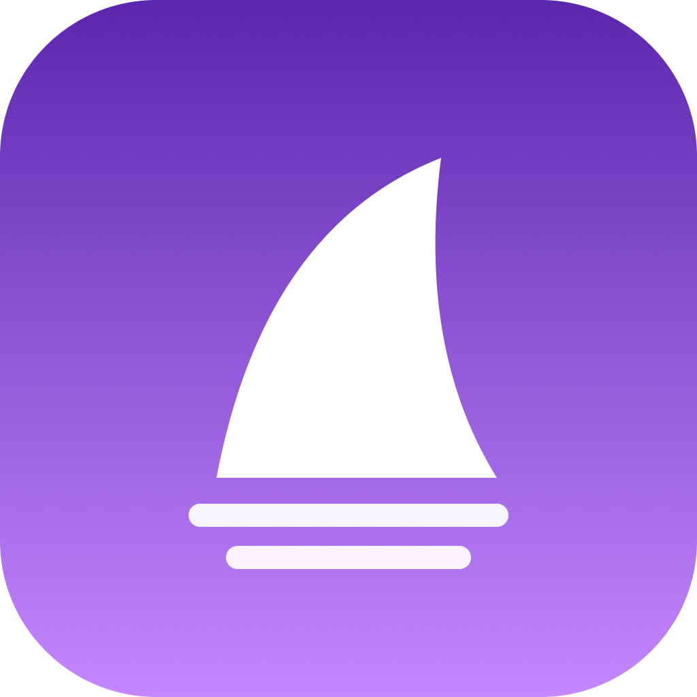

# R1 Control Center

<p align="center">
  
</p>

<p align="center">
  <a href="LICENSE"></a>
  
  
</p>

A native macOS configurator for the **Attack Shark R1** wireless gaming mouse. Built with SwiftUI and IOKit — no third-party software required.

> Based on [OpenSharkMacOS](https://github.com/Pl3ntz/OpenSharkMacOS) by Vitor Plentz, extended with DPI management, polling rate control, power settings, device profiles, and multi-language support.

---

## Features

- **Button remapping** — remap all 6 buttons to mouse functions, media keys, or any keyboard shortcut
- **DPI profiles** — 6 configurable DPI slots (100–10000 DPI), active slot indicator, ripple control and angle snap
- **Polling rate** — 125 / 250 / 500 / 1000 Hz
- **Power management** — key response time, sleep timer, deep sleep timer
- **Device profiles** — save multiple named configurations, switch and apply them in one click
- **Multi-language** — English, Türkçe, Português (auto-detected from system locale, switchable in-app)
- **Persistent settings** — all settings survive app restarts and are written to onboard memory

## Requirements

- macOS 14 Sonoma or later
- Attack Shark R1 via USB-C cable or 2.4 GHz dongle

## Build

```sh
git clone <repo-url>
cd r1-control-center
swift build
bash scripts/make-app.sh
open "dist/R1 Control Center.app"
```

On first launch, grant **Input Monitoring** when prompted (System Settings → Privacy & Security → Input Monitoring), then reopen the app. The app is signed with a local self-signed certificate so the permission persists across rebuilds.

## Project layout

```
Sources/R1Kit/         HID transport, report builders, data models (no UI)
Sources/OpenSharkApp/  SwiftUI app — views, MouseModel, LanguageManager
scripts/make-app.sh    bundles the executable into a .app with icon
scripts/setup-codesign.sh  one-time local certificate setup
docs/PROTOCOL.md       reverse-engineered HID protocol reference
```

## How it works

The R1 exposes a vendor HID interface (64-byte feature reports). Settings are written as structured byte payloads; the firmware ACKs on report `0x03`. The protocol was reverse-engineered from the Windows driver and community work — see [docs/PROTOCOL.md](docs/PROTOCOL.md) for the full spec.

## Credits

Protocol research: [xb-bx/attack-shark-r1-driver](https://github.com/xb-bx/attack-shark-r1-driver)  
Original macOS app: [Pl3ntz/OpenSharkMacOS](https://github.com/Pl3ntz/OpenSharkMacOS)

## Disclaimer

Not affiliated with or endorsed by Attack Shark. "Attack Shark" and "R1" are used solely to identify hardware compatibility. Use at your own risk.

## License

MIT — see [LICENSE](LICENSE).  
Original copyright © 2026 Vitor Plentz. Modifications by Berk Emir.
